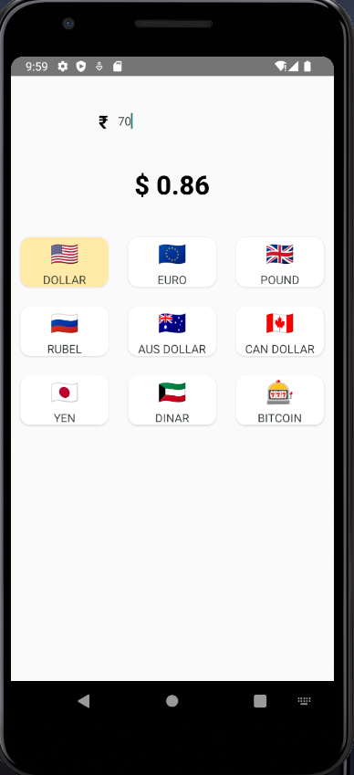
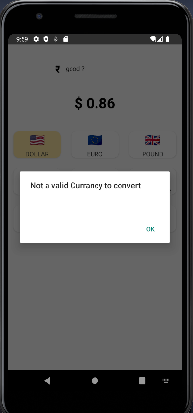
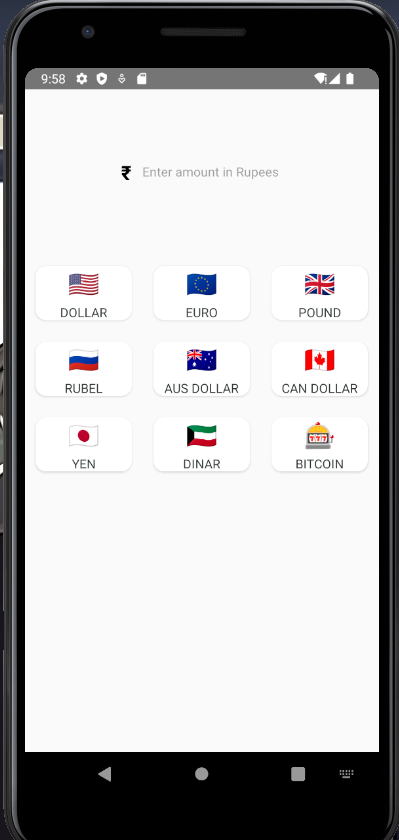
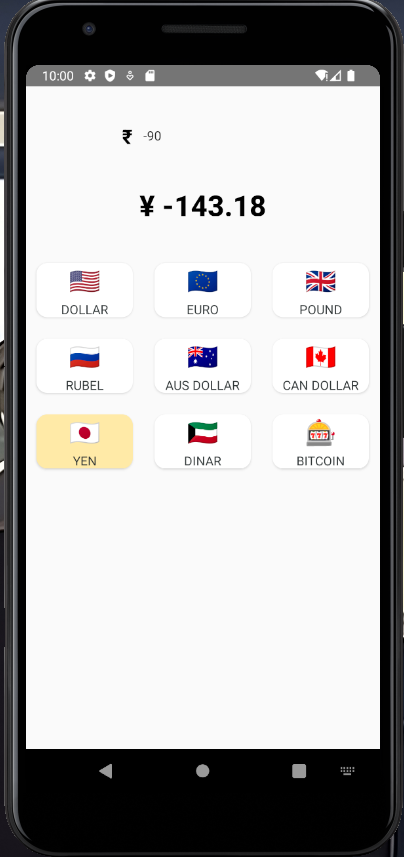

# CurrencyConverter

CurrencyConverter is a React Native application that allows users to easily convert currencies. The app provides real-time exchange rates and supports multiple currencies, making it convenient for travelers and international shoppers.

## Download

Click the button below to download the APK for Android.

[](https://drive.google.com/uc?export=download&id=1ig65-_MsifLekrKfZrHfqmGB__MAH7vF)

## Demo Images

Below are some screenshots of the CurrencyConverter app:

### App Icon


### Currency Convert Screen


### Error Check Screen


### First Screen


### Negative Currency Error


## Steps for Developers

If you are a developer and want to fork this repository, follow the steps below:

1. **Fork the Repository**: Click on the 'Fork' button at the top right corner of this repository to create a copy in your GitHub account.

2. **Clone the Repository**: Clone the forked repository to your local machine using the following command:
    ```sh
    git clone https://github.com/your-username/CurrencyConverter.git
    ```
    Replace `your-username` with your GitHub username.

3. **Navigate to the Project Directory**:
    ```sh
    cd CurrencyConverter
    ```

4. **Install Dependencies**:
    ```sh
    npm install
    ```

5. **Set Up the Android Environment**:
    Make sure you have Android Studio and the Android SDK installed. Set up the necessary environment variables:
    ```sh
    export ANDROID_HOME=/path/to/your/android/sdk
    export PATH=$PATH:$ANDROID_HOME/tools:$ANDROID_HOME/platform-tools
    ```

6. **Run the App**:
    To run the app on an Android emulator or connected device:
    ```sh
    npx react-native run-android
    ```

7. **Generate a Release APK**:
    To generate a release APK, navigate to the `android` directory and run:
    ```sh
    cd android
    ./gradlew assembleRelease
    ```

    The APK will be generated at `android/app/build/outputs/apk/release/app-release.apk`.

Feel free to customize this README.md as per your project's requirements.
